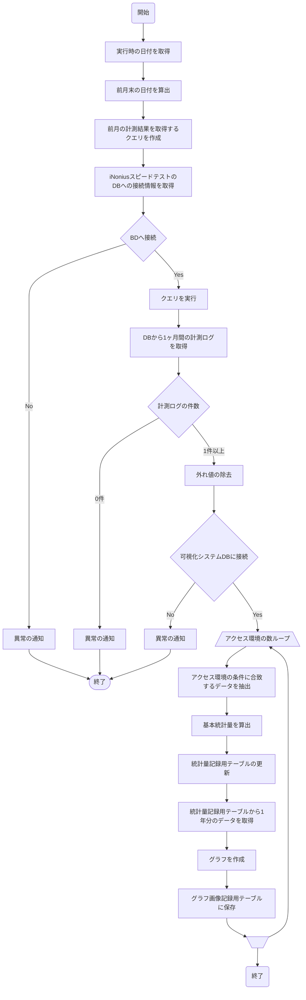
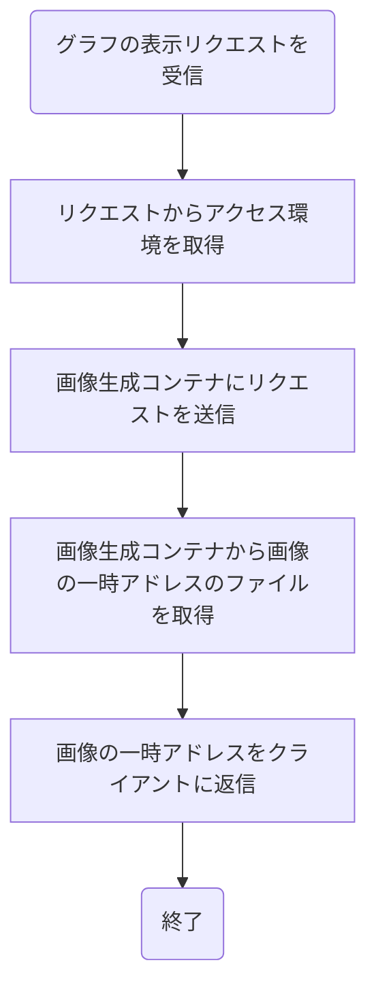
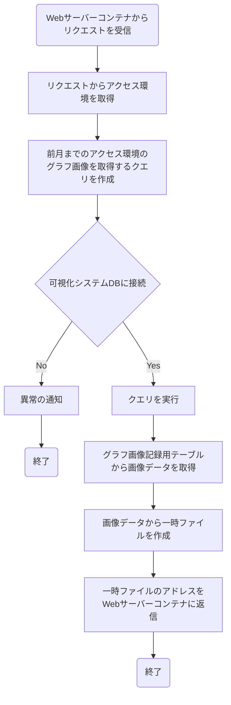
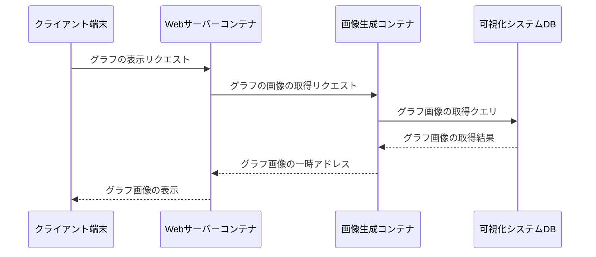

# 序章
## 背景と目的
ユーザーがネットワーク通信品質を調べるために，一般に Web ベースのスピードテストサイトが用いられる．このようなサイトは多数運用されており，計測結果を統計情報の掲載やインターネットの通信品質の分析などに活用されている．しかし，通信品質において，アクセス網の種類やインターネット接続方式などのアクセス環境が通信品質にどのように影響を与えるかについては，詳細な情報が提供されていない．
本研究では，アクセス環境による通信品質の影響を明らかにするために，アクセス環境による通信品質の違いを調査し，IPv4 と IPv6 の比較の観点から分析する．それにより，アクセス環境の違いによる分析の意義を示す．また，通信品質の違いを可視化するシステムを開発し，アクセス環境による通信品質の違いをユーザーに直感的に理解できるようにする．
## 本論文の構成

# 関連研究
## スピードテストサイト

## Network Information API

# アクセス環境の影響の調査
## 調査方法
- 本研究ではアクセス環境として以下のように分類をして，それぞれ調査する．
  - インターネットサービスプロバイダの網
    - IPv4/IPv6で同じ場合
    - IPv4/IPv6で異なる場合
  - アクセス網の種類
    - FTTH
    - CATV
    - Mobile
  - インターネット接続方式
    - IPv4/IPv6共にIPoE
    - IPv4/IPv6共にPPPoE
    - IPv4がPPPoE，IPv6がIPoE
- 調査にはiNoniusスピードテストの計測ログを用いる．
  - 計測ログには，計測日時，ISP，スループット，RTT，MSS などの情報が含まれている．

| 項目           | 説明                                 |
| -------------- | ------------------------------------ |
| timestamp      | 計測が行われた日時                   |
| ip             | 計測元のIPアドレス                   |
| ispInfo        | ISPに関する情報(社名，本拠地など)    |
| ua             | 計測端末のOSやブラウザの情報         |
| connectionType | Network Information APIの結果        |
| lang           | ブラウザの言語設定                   |
| dl             | ダウロードのスループットの計測結果   |
| ul             | アップロードのスループットの計測結果 |
| ping           | RTTの計測結果                        |
| jitter         | RTTの揺らぎの計測結果                |
| mss            | MSSのサイズ                          |
| ttl            | TTLの値                              |
| lossRate       | パケットロス率の計測結果             |
| defaultIp      | デフォルトのIP                       |
| srcPort        | 計測元のソースポート                 |

  - 分析の対象としたデータの計測期間は 2022 年 10 月 1 日〜 2023 年 5 月 31 日と 2023 年 6 月 1 日 〜 2024 年 6 月 31 日のログを使用した．
  - このうち，IPv4/IPv6 デュアルスタック環境におけるアップロードとダウンロードのスループットと RTT のデータを使用する．
  - ISP の判定には計測ログに含まれる `ispInfo` の情報を用いて，ISP の判定を行った．
    - iNonius スピードテスト内で計測を行うLibrespeed がipinfo.ioに問い合わせた結果である．
  - アクセス網は計測ログだけでは判定できないため， GeoLocation Technology が提供する「どこどこ JP」を使用した．
  - インターネット接続方式の判定には，計測ログに含まれる MSS の値を用いて，先行研究と同様に表のように判定した．

| IPv4 接続方式 | IPv6 接続方式 | IPv4 MSS | IPv6 MSS |
| ------------ | ------------ | -------- | -------- |
| IPoE         | IPoE         | 1460     | 1440     |
| PPPoE        | PPPoE        | 1452     | 1394     |
| PPPoE        | IPoE         | 1452     | 1440     |

## スループットへの影響
### アクセス網によるスループットへの影響
次にアクセス網の種類によるスループットへの影響について述べる．\cref{fig:old_Line_dl,fig:new_Line_dl}はダウンロードのスループットのグラフ，\ref{fig:old_Line_ul,fig:new_Line_ul}はアップロードのスループットのグラフである．\cref{old_FTTH_dl,new_FTTH_dl}はそれぞれの期間でFTTHを使用した場合のダウンロードのスループットである．両者とも100Mbps付近にピークが表れて緩やかにデータ数が減っていくふるまいを見せている．これはアップロードの場合も類似する振る舞いをしている．一方，\cref{old_CATV_dl,new_CATV_dl}のCATVを使用した場合はピークが表れる位置がFTTHと異なり，ダウンロードの場合は340Mbps付近に表れる．アップロードの場合は10Mbpsにピークが表れている．CATVを使用したインターネット接続サービスについて調査すると，ダウンロードのスループットが最大340Mbps，アップロードのスループットが最大10Mbpsであると述べているサービスがいくつか確認された．このことからアクセス網の種類によってスループットの限界が異なることがわかる．さらに\cref{new_Mobile_dl,new_Mobile_ul}のMobileの場合は10Mbps付近にピークが表れている．Mobileを使用した場合のスループットの限界はFTTHやCATVに比べて低いことがわかる．ただし，\cref{old_CATV_dl,new_CATV_dl}を比較すると，340Mbpsのピークの前後の振る舞いが異なる．ピークの前後のデータの割合は表のように変化し340Mbps以上のデータが約20%増加している．CATVによる配信サービスについて調べると，旧来使用されてきたHFC(Hybrid Fiber-Coaxial)方式や同軸方式を光ファイバーに置き換える動きが進んでおり，総務省の資料によると約80%の事業者がFTTH方式を採用していることがわかった．このことから，アクセス網の種類だけでなくアクセス環境全体が時期によって変化していることがわかる．
以上のことからアクセス網の種類によってスループットの限界が異なることがわかったが，その振る舞いは時期によって異なることがわかった．

| 期間 | 340Mbps未満のデータの割合 | 340Mbps以上のデータの割合 |
| ---- | ------------------------- | ------------------------- |
| (1)  | 77.11%                    | 22.89%                    |
| (2)  | 57.84%                    | 42.16%                    |

### インターネット接続方式によるスループットへの影響
次にインターネット接続方式によるスループットへの影響について述べる．
- IPv4/IPoEともに

## RTTへの影響

# 可視化システム
3章からアクセス環境によって通信品質に差が生じることがわかった．特にスループットについては振る舞いがことなるため，スピードテストサイトのユーザーが実際に体感する通信速度とは異なる可能性がある．そこで，本章では，スループットの可視化システムを提案する．
## システム概要
3 章の結果を踏まえて，アクセス環境によるスループットの違いをユーザーに直感的に理解できるようにするために，iNonius スピードテストの計測ログの統計情報を可視化するシステムを開発し，可視化サイトを開設した．図 2 にシステム構成を示す．iNonius スピードテストサーバーから，毎月の計測ログを取得し，データ処理コンテナでアクセス環境ごとに最大値，最小値，中央値，四分位範囲，平均値からなる統計情報を算出し，統計量記録用テーブルに保存する．統計量記録用テーブルから 1 年分の統計量を取得して，表示用の画像を作成して，グラフ画像記録用テーブルにバイナリデータとして保存する．クライアントからのアクセス環境ごとの集計結果の要求を Web サーバーコンテナを受け取ると画像生成コンテナを経由して，グラフ画像記録用テーブルからバイナリデータを取得後，要求に対応する 1 年分の集計結果のグラフを画像（JPEG） ファイルとしてクライアントに返す．図 3 はアクセス回線が CATV の場合の IPv6 のダウンロードスループットのグラフである．可視化サイトにはアクセス環境ごとに IPv4 と IPv6，ダウンロードとアップロードのスループットをそれぞれ示す 4 つのグラフが表示される．
## システムの開発
## システムの評価
|     | そう思う | ややそう思う | あまりそう思わない | そう思わない |
| --- | -------- | ------------ | ------------------ | ------------ |
| Q5  | 5        | 10           | 1                  | 1            |
| Q6  | 6        | 6            | 3                  | 2            |
| Q7  | 5        | 7            | 5                  | 0            |

# まとめ
## まとめ
## 今後の展望

# 使えそうな文
- アクセス環境によって通信品質に影響を与える場合，スピードテストサイトの計測ログを使用して通信品質の調査を行うときに切り分けを行わなければならない．しかし，アクセス環境が通信品質にどのように影響を与えるかについて，詳細な情報が提供されていない．そこでアクセス環境による通信品質 (スループット，RTT) への影響を，IPv4 と IPv6 の比較の観点から分析する．

# フローチャート
## データ処理コンテナ

## Webサーバーコンテナ

## 画像生成コンテナ

## シーケンス図

## 動作の説明
Webサーバーコンテナはクライアントからのリクエストを受け取り、画像生成コンテナにアクセス環境に基づいたグラフ画像の生成を依頼します。画像生成コンテナは可視化システムDBから必要なデータを取得し、グラフ画像を生成して一時ファイルとして保存します。その後、Webサーバーコンテナに一時ファイルのアドレスを返し、Webサーバーコンテナはクライアントにグラフ画像を表示します。

# 使わなくなった表
\begin{comment}
\begin{table}
    \centering
    \caption{アンケート結果}
    \resizebox{\textwidth}{!}{
        \begin{tabular}{ccccc} \hline
            & そう思う & ややそう思う &
            \begin{tabular}{c}
                あまり\\そう思わない
        \end{tabular}
        & そう思わない \\
        \hline \hline
        \begin{tabular}{c}
            Q5. iNonius Speed Testの\\統計情報を可視化できることに\\意義を感じますか．
        \end{tabular}
        & 5 & 10 & 1 & 1 \\
        \begin{tabular}{c}
            Q6. アクセス環境別の統計情報と\\計測結果を比較することに\\意義を感じますか．
        \end{tabular}
        & 6 & 6 & 3 & 2 \\
        \begin{tabular}{c}
            Q7. 本サイトで使用している\\グラフ(箱ひげ図)の表現は\\適切だと思いますか．
        \end{tabular}
        & 5 & 7 & 5 & 0 \\ \hline
    \end{tabular}
    }
    \label{tab:questionnaire}
\end{table}
\FloatBarrier
\end{comment}

# 開発環境
## ホスト
| 項目     | 説明                                    |
| -------- | --------------------------------------- |
| OS       | Ubuntu Ubuntu 22.04.5 LTS               |
| カーネル | 5.15.0-125-generic                      |
| CPU      | Inter(R) Core(TM) i7-9700 CPU @ 3.00GHz |
| メモリ   | 15GB                                    |
| Docker   | Docker version 27.2.0, build 3ab4256    |

## Webサーバーコンテナ
| 項目  | 説明               |
| ----- | ------------------ |
| OS    | Alpine Linux v3.20 |
| nginx | nginx/1.27.2       |

## 画像生成コンテナ
| 項目       | 説明                           |
| ---------- | ------------------------------ |
| OS         | Debian GNU/Linux 12 (bookworm) |
| Python     | Python 3.9.20                  |
| Flask      | 3.0.3                          |
| Flask-Cors | 5.0.0                          |
| PyMySQL    | 1.1.1                          |
| SQLAlchemy | 2.0.36                         |

## データ処理コンテナ
## 画像生成コンテナ
| 項目       | 説明                           |
| ---------- | ------------------------------ |
| OS         | Debian GNU/Linux 12 (bookworm) |
| Python     | Python 3.9.20                  |
| PyMySQL    | 1.1.1                          |
| SQLAlchemy | 2.0.36                         |
| matplotlib | 3.9.2                          |
| numpy      | 2.1.2                          |
| pandas     | 2.2.3                          |

## 可視化システムDB
| 項目    | 説明                        |
| ------- | --------------------------- |
| OS      | Ubuntu 24.04.1 LTS          |
| MariaDB | mariadb from 11.5.2-MariaDB |

